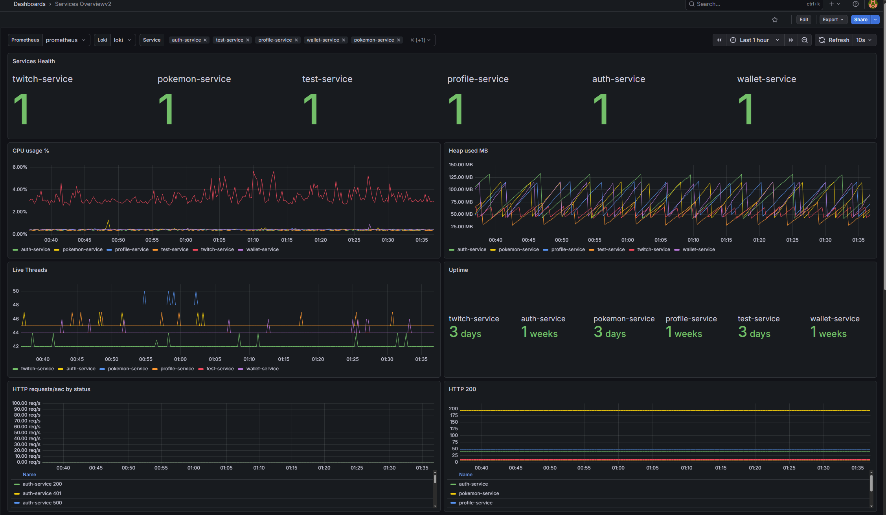
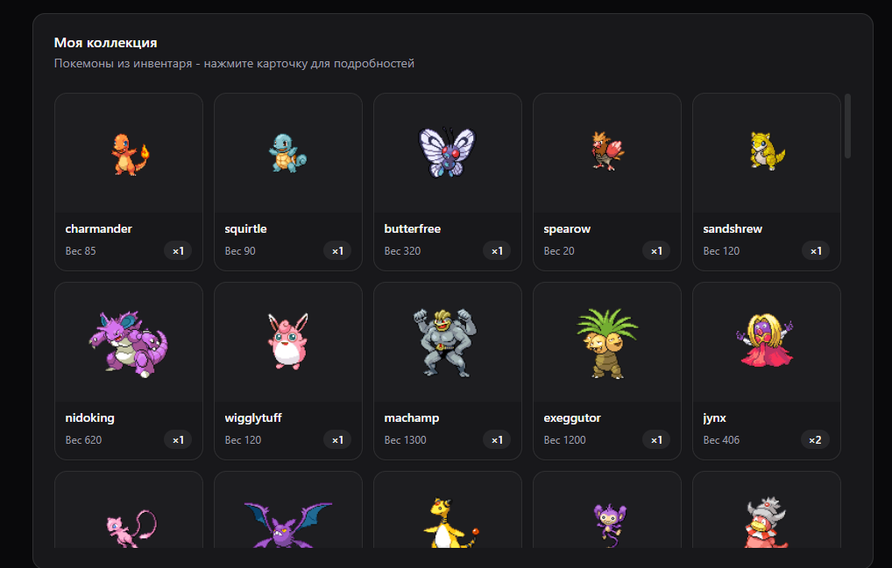

# JavaSite

Бэкенд для пет-проекта: гача-игра с осьминогами плюс инфраструктурная всячина вокруг - авторизация, кошелёк, статистика Twitch.tv сайта, которую собираю сам.

Фронтенд на Vue живёт в другом репозитории и ходит сюда по REST: [gorelov.net](https://gorelov.net/)

## Стек

Java 17, Spring Boot 3.5 (Web, Data JPA, Security, Kafka, Redis), .NET 9 - для боевого сервиса, PostgreSQL, Redis, Kafka, RabbitMQ, Docker Compose. CI на GitHub Actions гоняет тесты и деплоит на прод при пуше в main - если тесты красные, деплой не поедет.

## Из чего это состоит

Maven-монорепозиторий на Spring Boot 3.5 / Java 17 - набор независимых сервисов, каждый в своём модуле, плюс один сервис на .NET, который живёт вне общей сборки.

- **auth** - регистрация, логин, JWT (access + refresh). Секрет общий для всех сервисов, которые его проверяют.
- **profile** - профиль пользователя, слушает события через Kafka.
- **twitchService** - статистика Twitch, кэш в Redis. Единственный сервис без авторизации вообще.
- **wallet** - баланс, периодические награды, журнал операций; общается с octopusService и по REST, и через Kafka.
- **octopusService** - сама игра: гача, инвентарь, экипировка, боевые команды, данжи. Самый большой и модуль в репе.
- **fightService** - пошаговый боевой движок на .NET (ИИ мобов, формулы урона). octopusService стартует бой через него по HTTP, а дальше во время самого боя фронтенд ходит в него уже напрямую.
- **testApi** - учебный модуль, на котором я разбирался с RabbitMQ.
- **common** - общая библиотека (JWT-конвертер, обработка ошибок), не сервис, а просто Maven-зависимость для остальных.

Сервисы дёргают друг друга обычным HTTP, прокидывая JWT пользователя дальше по цепочке. У каждого своя база в общем Postgres-инстансе, миграции - через Flyway. Кэш - Redis, событийка - Kafka (и немного RabbitMQ для старого демо-модуля).

## Запуск локально

Всё поднимается одной командой - она соберёт джарники и .NET-проект и поднимет Postgres/Redis/RabbitMQ/Kafka вместе со всеми сервисами в докере:

```bash
cp .env.local.example .env.local
./scripts/local-backend.sh up      # на винде - scripts/local-backend.ps1
```

## Мониторинг

Prometheus + Grafana + Loki (логи) + Alloy, поднимается своим docker-compose стеком и деплоится вместе с бэкендом при пуше в main.



## Скриншот из игры



